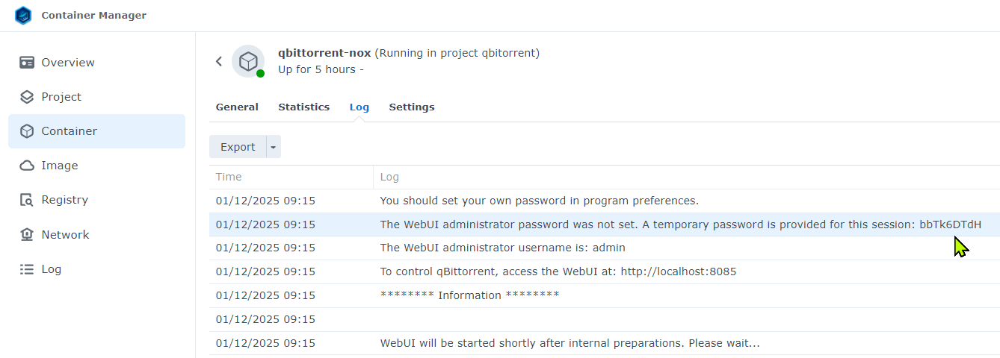

=====================================
GhostTracker for qBittorrent-nox Docker Image
=====================================

.. image:: https://github.com/qbittorrent/docker-qbittorrent-nox/actions/workflows/release.yaml/badge.svg
   :target: https://github.com/qbittorrent/docker-qbittorrent-nox/actions

Repository on Docker Hub: https://hub.docker.com/r/qbittorrentofficial/qbittorrent-nox  
Repository on GitHub: https://github.com/qbittorrent/docker-qbittorrent-nox

This project builds a Docker image for `qBittorrent-nox` based on a custom version of libtorrent called `GhostTracker`. 
The custom libtorrent disables tracker reporting of uploads, downloads, and completion events while retaining full functionality for downloading torrents.
In other words, it means that your ratio is not moving while you can still download.

When installed you should see that :

.. note::
   For more detailed information about qBittorrent's Docker images, visit the original repository:
   https://github.com/qbittorrent/docker-qbittorrent-nox

Usage
-----

0. **Prerequisites**

   * Install Docker: https://docs.docker.com/get-docker/
   * Optionally, install Docker Compose: https://docs.docker.com/compose/install/

1. **Download the Repository**

   Clone this repository or download it as a `.zip` on your computer - you will need to transfer those files later to the NAS but it is easier to change the files on your computer than on the NAS directly!:
   https://github.com/qbittorrent/docker-qbittorrent-nox/archive/refs/heads/main.zip
   

2. **Edit the `.env` File on you computer**

   Open the `.env` file in the repository and configure the following variables:

   - ``QBT_LEGAL_NOTICE``: Confirm the legal notice (`confirm` to accept).
   - ``QBT_VERSION``: Specify the qBittorrent version (e.g., `5.0.3`) - I never teste on v4.*.
   - ``QBT_WEBUI_PORT``: WebUI port (e.g., `8085`).
   - ``QBT_CONFIG_PATH``: Full path for storing qBittorrent configurations.
   - ``QBT_DOWNLOADS_PATH``: Full path for torrent downloads.
   - ``PUID``: User ID for the container.
   - ``PGID``: Group ID for the container.
   - ``TZ``: Time zone (e.g., `Europe/Paris`).

   .. tip::
      To find the correct ``PUID`` and ``PGID``:
      
      - SSH into your NAS or host machine.
      - Run: ``id <your-username>``
      - Example output: ``uid=1029(jbesclapez) gid=100(users)``
      - Use the UID value as ``PUID`` (e.g., `1029`) and GID value as ``PGID`` (e.g., `100`).

3. **Run the Image**

   Copy the files to the root folder you are going to use on your NAS.
   It should look like this :
   / (root of the repo)
   ├── Dockerfile
   ├── docker-compose.yml
   ├── entrypoint.sh
   ├── .env
   ├── config/ (optional)
   ├── downloads/ (optional)

   Open Container Manager and run it. It will take some time (15 min) as it needs to compile libtorrent and qbitorrent.

4. **Access the WebUI**

   Open your browser and navigate to:
   ``http://<NAS-IP>:8085``

   - Default username: ``admin``
   - Password for qBittorrent >= 4.6.1:
     qBittorrent generates a temporary password and prints it to the logs. Run:
     .. code-block:: shell

        docker logs qbittorrent-nox

   - Change the password after logging in:
     Navigate to `Tools > Options... > Web UI > Authentication`.

Manual Build
------------
Refer to the `manual_build` folder for detailed instructions:
https://github.com/qbittorrent/docker-qbittorrent-nox/tree/main/manual_build

Debugging
---------
To attach a debugger to the running process, follow these steps:

1. **Modify the Docker Compose File**:
   Remove the `read-only` mode and add `--cap-add=SYS_PTRACE`.

2. **Install Debugging Tools**:
   .. code-block:: shell

      docker exec -it <container-id> /bin/sh
      apk add gdb musl-dbg

3. **Attach gdb**:
   .. code-block:: shell

      ps -a  # Find the PID of qbittorrent-nox
      gdb -p <PID>
